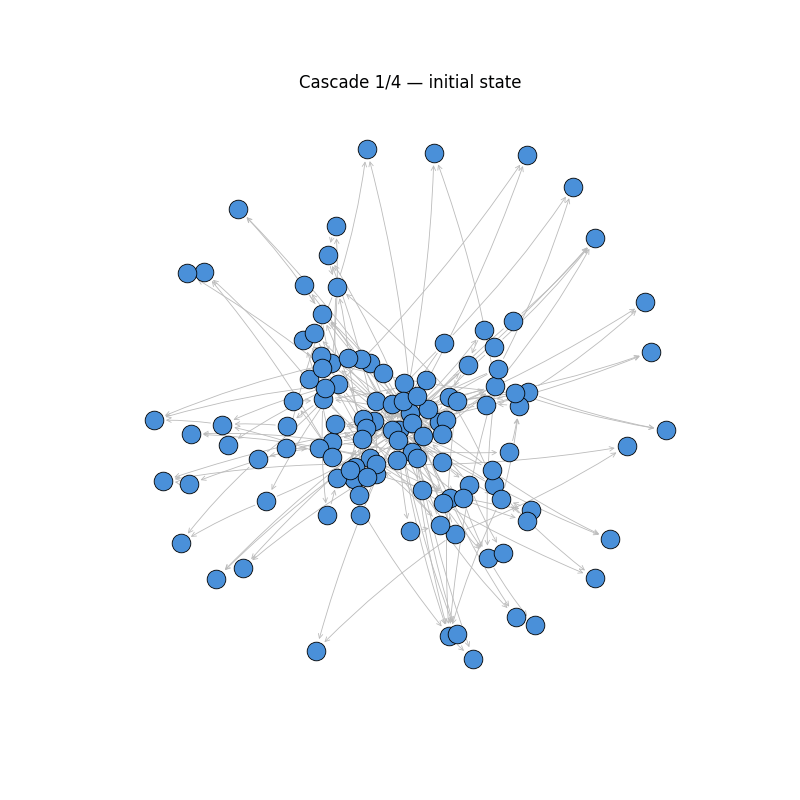

# Self-Organized Criticality in Circular Economy Networks

> *Course project for CLL798 — Complexity Science in Chemical Industry, IIT Delhi (April 2026)*
> *Jaagrav Shakalya — Entry No. 2023CH10222*

## What this project is about

A **circular economy** is an industrial system in which factories are tightly coupled together: one plant's waste becomes another plant's raw material, with nothing thrown away. The classic real-world example is the [Kalundborg eco-industrial park](https://en.wikipedia.org/wiki/Kalundborg_Eco-industrial_Park) in Denmark, where about thirty plants — a power station, an oil refinery, plasterboard and pharmaceutical factories, water utilities, and local farms — exchange steam, gypsum, fly ash, sulfur, and biomass through a dense network of pipes and conveyor belts. The arrangement is celebrated as efficient and sustainable.

But the same coupling that makes such systems efficient also makes them **fragile in an interesting way**. Because every plant depends on its neighbours, a small disruption at one site can cascade through the network: plant A trips, starving plant B of feedstock, which then trips and starves plants C and D, and so on. This project asks a specific question about that fragility:

> **Do circular-economy networks self-organize into a critical state, and what does that imply about their vulnerability?**

The notion of a "critical state" comes from physics. A system is **self-organized critical (SOC)** if, without any external tuning, it settles into a regime where small perturbations occasionally trigger cascades of every possible size — from tiny single-plant trips to system-spanning blackouts — with the cascade-size distribution following a power law. SOC is the same statistical signature seen in earthquake magnitudes (Gutenberg–Richter), neuronal avalanches in brain tissue, forest fires, and the Bak–Tang–Wiesenfeld sandpile that started the field in 1987. The hypothesis here is that an industrial symbiosis network is just another flavour of the same phenomenon.

## What this project does

The project models a circular-economy network as a directed graph and runs an agent-based cascading-failure simulation on it (the **Motter–Lai model**, a standard tool in the cascading-failure literature). Each plant has a baseline load and a capacity slightly above its load. At every timestep, one randomly chosen plant is perturbed below its capacity and trips; its load redistributes to downstream neighbours along the edges of the network; any neighbour now overloaded also trips, recursively, until the cascade resolves. The size of each cascade is recorded.

The simulation is run across three different network topologies — Erdős–Rényi (random), Barabási–Albert (scale-free, the topology that real industrial networks resemble most), and modular (community-structured) — and across a range of mean degrees, to ask how the network's structural properties influence the cascade statistics.

The project then makes two main claims:

**Claim 1 — These networks really are self-organized critical.** The avalanche-size distribution follows a clean power law with exponent τ ≈ 2 across all topologies tested, the small-avalanche behaviour is universal across system sizes (finite-size scaling holds), and the power law is overwhelmingly preferred over an exponential alternative (likelihood ratio R ≈ 8000, p < 10⁻⁴). This means circular-economy networks have an *intrinsic* statistical vulnerability to scale-free cascades that cannot be optimized away — it's a structural property, not a design flaw.

**Claim 2 — Standard centrality measures miss the most dynamically critical plants.** The "keystone" plants identified by tracking which sites participate most often in real cascades (the *dynamic* keystones) correlate only weakly with the keystones identified by classical graph centrality measures: in-degree (Spearman ρ = 0.27), betweenness (ρ = 0.36), and PageRank (ρ = 0.44). Even PageRank — the best of the three — explains less than 20% of the variance in dynamic importance. This suggests that vulnerability assessments based on topology alone, common in the industrial symbiosis literature, systematically underestimate certain "hidden keystone" plants whose criticality emerges only from cascade dynamics.

## Repository structure

\`\`\`
circular-economy-soc/
├── src/                      # Simulation and analysis code
│   ├── network.py            # Topology generators (ER, BA, modular)
│   ├── simulate.py           # Motter–Lai cascade dynamics
│   ├── sweep.py              # Connectivity and finite-size sweeps
│   ├── analysis.py           # Power-law fitting (Clauset–Shalizi–Newman)
│   ├── keystones.py          # Dynamic vs static centrality analysis
│   ├── plots.py              # All result figures
│   ├── cascade_viz.py        # Cascade animation and snapshots
│   └── config.py             # Locked-in simulation parameters
├── data/                     # Saved simulation runs (.npy files)
├── figures/                  # All figures used in the manuscript
├── notebooks/                # Exploratory work
├── report/                   # LaTeX manuscript
└── prompts.md                # Log of LLM prompts used (per assignment rules)
\`\`\`

## How to reproduce

All results can be regenerated from scratch in about 10 minutes on a modern laptop:

\`\`\`bash
git clone https://github.com/JaagravShakalya/circular-economy-soc.git
cd circular-economy-soc
python3 -m venv venv
source venv/bin/activate
pip install -r requirements.txt

# Run all simulations (~5-10 min)
python -m src.sweep

# Regenerate all figures
python -c "from src.plots import *; figure1_topology_comparison(); figure2_exponent_vs_connectivity(); figure3_subcritical_to_supercritical(); figure4_finite_size_scaling(); figure5_dynamic_vs_static_keystones(); figure_kalundborg()"

# Cascade visualizations
python -c "from src.cascade_viz import static_cascade_snapshot, animated_cascade_gif; static_cascade_snapshot(); animated_cascade_gif()"
\`\`\`

The full report PDF is in \`report/main.pdf\`.

## Key results at a glance

| Quantity                                 | Value              |
| ---------------------------------------- | ------------------ |
| Power-law exponent τ (BA, ⟨k⟩=4)         | 1.96 ± 0.01        |
| Likelihood ratio vs exponential          | R = 7928, p < 10⁻⁴ |
| τ range across topologies                | 2.0 – 3.0          |
| Largest cascade observed (N=400)         | ~250 plants        |
| Spearman ρ (dynamic vs PageRank)         | 0.44               |
| Spearman ρ (dynamic vs betweenness)      | 0.36               |
| Spearman ρ (dynamic vs in-degree)        | 0.27               |

## Acknowledgements

This project was developed with the assistance of an LLM (Claude). All prompts used during development are logged verbatim in \`prompts.md\` as required by the course guidelines. The Motter–Lai cascading-failure model and the Clauset–Shalizi–Newman power-law fitting methodology are adopted from the published literature; references are in the manuscript.

## License

MIT — see LICENSE file.
